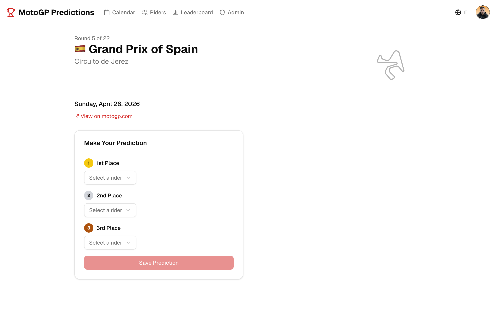
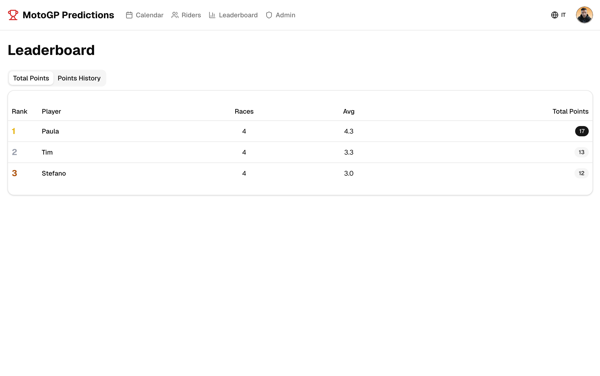
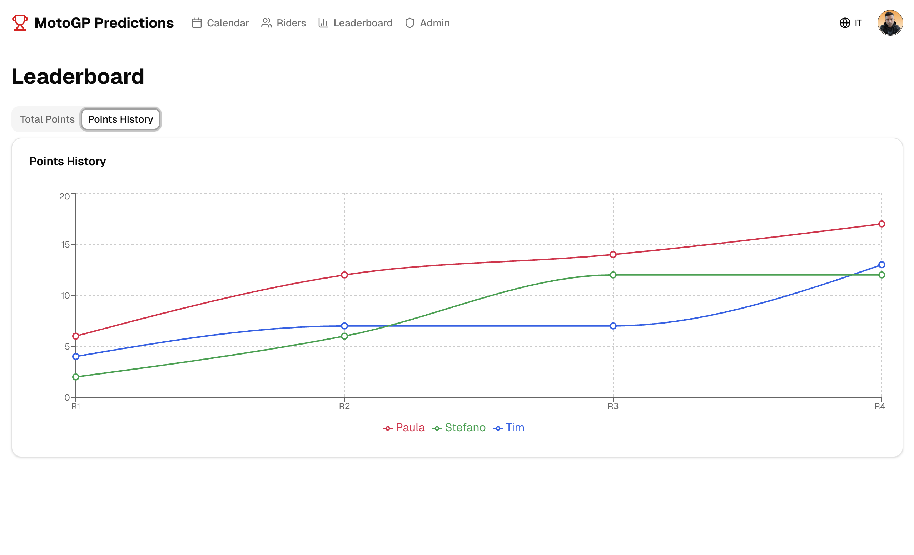

# MotoGP Predictions 2026

A full-stack web application for predicting MotoGP race podiums and competing with friends. Built with modern technologies as a showcase of full-stack development skills.


## Overview

Users predict the top 3 finishers for each MotoGP race, earn points based on accuracy, and compete on a live leaderboard. The app features a complete admin panel, real-time scoring, multi-language support, and a "No Spoiler" mode to preserve the prediction experience.

## Features

### For Users
- **Race Predictions** - Select your predicted podium (1st, 2nd, 3rd) for each race
- **Live Leaderboard** - Track standings with cumulative points chart (Recharts)
- **No Spoiler Mode** - Official results are hidden until you submit your prediction
- **Profile Management** - Custom nickname, avatar upload, account deletion
- **Multi-language** - Full English and Italian support with automatic locale detection

### For Admins
- **Dashboard** - Overview of users, predictions, confirmed/pending races
- **Results Management** - Enter, edit, and delete official race results
- **Automatic Scoring** - Points calculated instantly when results are confirmed
- **Race Management** - Update dates, status (postponed/cancelled/rescheduled), track images
- **Riders Management** - Full CRUD for riders, teams, wildcard entries, and rider images
- **User Management** - Edit user roles/nicknames, delete users with cascade

### Scoring System
| Prediction | Points |
|---|---|
| Exact position match | 2 pts |
| Rider on podium, wrong position | 1 pt |
| Rider not on podium | 0 pts |
| **Max per race** | **6 pts** |

## Tech Stack

### Frontend
| Technology | Purpose |
|---|---|
| [Next.js 16](https://nextjs.org/) | React framework with App Router & Turbopack |
| [React 19](https://react.dev/) | UI library |
| [TypeScript 5](https://www.typescriptlang.org/) | Type safety |
| [Tailwind CSS 4](https://tailwindcss.com/) | Utility-first styling |
| [shadcn/ui](https://ui.shadcn.com/) | Radix UI component library |
| [Recharts](https://recharts.org/) | Leaderboard charts |
| [Lucide React](https://lucide.dev/) | Icon library |
| [next-themes](https://github.com/pacocoursey/next-themes) | Dark/Light mode |
| [Sonner](https://sonner.emilkowal.dev/) | Toast notifications |

### Backend
| Technology | Purpose |
|---|---|
| [Next.js Server Actions](https://nextjs.org/docs/app/building-your-application/data-fetching/server-actions-and-mutations) | Server-side mutations |
| [Auth.js v5](https://authjs.dev/) | Authentication (Google OAuth + Credentials) |
| [Drizzle ORM](https://orm.drizzle.team/) | Type-safe database queries |
| [SQLite](https://www.sqlite.org/) (better-sqlite3) | Embedded database |
| [Zod](https://zod.dev/) | Schema validation |
| [bcryptjs](https://github.com/dcodeIO/bcrypt.js) | Password hashing |

### Internationalization
| Technology | Purpose |
|---|---|
| [next-intl](https://next-intl.dev/) | i18n framework with routing |
| Supported locales | English (`en`), Italian (`it`), Spanish (`es`) |

## Architecture

```
src/
├── actions/              # Server Actions (mutations)
│   ├── admin.ts          # Admin operations (users, riders, races)
│   ├── auth.ts           # Registration, profile updates
│   ├── predictions.ts    # Save/update predictions
│   └── results.ts        # Race results & scoring
├── app/
│   ├── [locale]/         # Locale-aware routes
│   │   ├── admin/        # Admin panel (dashboard, results, races, riders, users)
│   │   ├── auth/         # Login, Register, Complete Profile
│   │   ├── calendar/     # Season calendar
│   │   ├── leaderboard/  # Standings & charts
│   │   ├── profile/      # User profile management
│   │   ├── race/[id]/    # Race detail & prediction form
│   │   └── riders/       # Riders & teams gallery
│   └── api/
│       ├── auth/          # Auth.js API routes + email verification endpoint
│       └── files/         # Serve uploaded files from persistent storage
├── components/
│   ├── admin/            # Admin-specific components
│   ├── auth/             # Login/Register forms
│   ├── calendar/         # Race calendar cards
│   ├── layout/           # Navbar, footer
│   ├── leaderboard/      # Standings table, charts
│   ├── predictions/      # Prediction form & cards
│   ├── profile/          # Profile management
│   ├── riders/           # Rider grid & cards
│   └── ui/               # shadcn/ui primitives
├── db/
│   ├── schema.ts         # Drizzle schema (8 tables)
│   ├── index.ts          # Database connection
│   └── seed.ts           # Seed script (races, teams, riders)
├── i18n/                 # next-intl configuration
├── lib/
│   ├── auth.ts           # Auth.js configuration
│   ├── email.ts          # Email service (nodemailer)
│   ├── scoring.ts        # Scoring algorithm
│   └── utils.ts          # Utility functions
├── middleware.ts          # Locale routing middleware
└── types/
    └── next-auth.d.ts    # Auth.js type extensions
```

## Database Schema

```
users ─────────┐
               ├── predictions ──── races
accounts ──────┤                      │
               ├── scores ────────────┘
               │
races ─────────┼── raceResults
               │
riders ────────┼── teams
               │
invitationCodes
```

**8 tables**: users, accounts, sessions, verificationTokens, invitationCodes, races, teams, riders, predictions, raceResults, scores

## Getting Started

### Prerequisites
- Node.js 18+
- npm

### Installation

```bash
# Clone the repository
git clone https://github.com/Spettacolo83/motogp_predictions_web.git
cd motogp_predictions_web

# Install dependencies
npm install

# Copy environment variables
cp .env.example .env

# Configure your .env file with:
# - AUTH_SECRET (generate with: npx auth secret)
# - Google OAuth credentials (optional, for Google login)
# - INVITATION_CODE for registration

# Generate database and run migrations
npm run db:generate
npm run db:migrate

# Seed the database with 2026 season data
npm run db:seed

# Start the development server
npm run dev
```

The app will be available at [http://localhost:3001](http://localhost:3001).

### Environment Variables

See `.env.example` for all required variables.

#### Authentication
| Variable | Required | Description |
|---|---|---|
| `AUTH_SECRET` | Yes | Auth.js secret key. Generate with: `npx auth secret` |
| `AUTH_GOOGLE_ID` | No | Google OAuth Client ID (for Google login) |
| `AUTH_GOOGLE_SECRET` | No | Google OAuth Client Secret |
| `AUTH_TRUST_HOST` | Prod | Set to `true` in production environments |
| `AUTH_URL` | Prod | Full base URL of the app (e.g. `https://yourdomain.com`). Required for email verification links and OAuth callbacks |

#### Database
| Variable | Required | Description |
|---|---|---|
| `DATABASE_URL` | No | Path to SQLite database file. Defaults to `./sqlite.db` |
| `DATA_DIR` | Prod | Persistent data directory for Docker deployments (e.g. `/app/data`). Stores database and uploaded files |

#### Email (SMTP)
| Variable | Required | Description |
|---|---|---|
| `SMTP_HOST` | No | SMTP server hostname (e.g. `mail.example.com`) |
| `SMTP_PORT` | No | SMTP port. Use `587` for STARTTLS, `465` for SSL |
| `SMTP_USER` | No | SMTP authentication username |
| `SMTP_PASS` | No | SMTP authentication password |
| `EMAIL_FROM` | No | Sender email address (e.g. `noreply@example.com`) |

> **Note:** If SMTP variables are not set, verification emails are logged to the server console instead of being sent. This is useful for local development.

#### Registration
| Variable | Required | Description |
|---|---|---|
| `INVITATION_CODE` | Yes | Code required for new user registration (private league) |

### Available Scripts

| Script | Description |
|---|---|
| `npm run dev` | Start dev server with Turbopack (port 3001) |
| `npm run build` | Production build |
| `npm run start` | Start production server |
| `npm run lint` | Run ESLint |
| `npm run db:generate` | Generate Drizzle migrations |
| `npm run db:migrate` | Apply database migrations |
| `npm run db:push` | Push schema directly to DB |
| `npm run db:seed` | Seed database with 2026 data |
| `npm run db:studio` | Open Drizzle Studio (DB GUI) |

## Screenshots

### Homepage
Dashboard with next race info, user stats, and quick navigation.


### Season Calendar
Full 2026 season calendar with race status, track layouts, and country flags.


### Race Prediction
Podium prediction form with rider selection for 1st, 2nd, and 3rd place.



### Leaderboard - Standings
Player rankings with total points, races played, and average score.



### Leaderboard - Points History
Cumulative points chart tracking each player's progression across races.



## Key Implementation Details

### Authentication Flow
- **Google OAuth**: One-click login with automatic profile creation (auto-verified)
- **Credentials**: Email/password with bcrypt hashing + email verification
- **Email Verification**: After registration, users must verify their email via a confirmation link before accessing the app. Admins can manually verify users or resend verification emails from the admin panel
- **Invitation Code**: Required for new registrations (private league)
- **Admin Role**: Automatically assigned to configured admin email

### No Spoiler Mode
When official results exist but a user hasn't predicted yet:
- Results are hidden behind a "No Spoiler" banner
- Users can still submit predictions after results are entered
- Results become visible only after submitting a prediction

### Server Actions Pattern
All mutations use Next.js Server Actions with:
- Authentication checks (`auth()`)
- Zod validation
- Error handling with typed returns
- Path revalidation for real-time updates

## License

This project is private and intended for personal use.

## Author

**Stefano Russello** - [GitHub](https://github.com/Spettacolo83)
